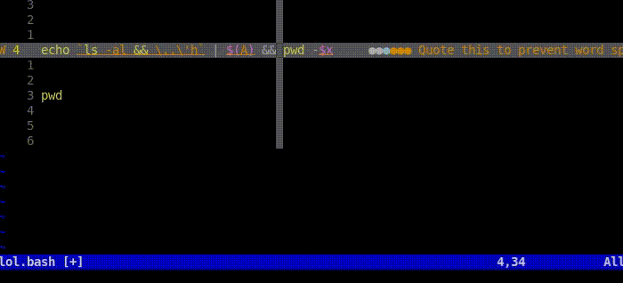
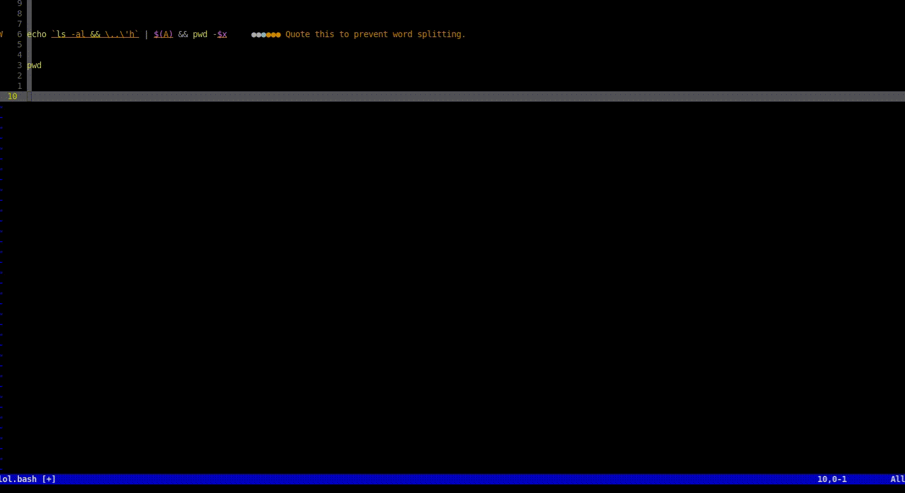
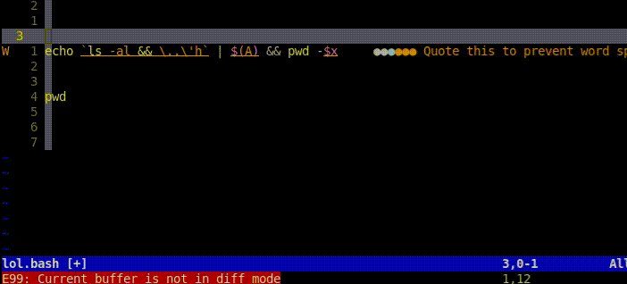

# neovim_nix_configs

## setup/installation
### run it as standalone

```sh
git clone "https://github.com/bolives-hax/neovim_nix_configs.git"
```

and
```sh
cd neovim_nix_configs
nix run .#
# OR
nix build .#
./result/bin/nvim
```

## "must know" keybinds
Note keybinds are expressed like this:

`a -> b -> c` press `a` then `b` and then `c`
and
`a + b -> c` press `a` AND `b` at the same time THEN (like after releasing `a+b` press `c`)

`<CR>` stands for "carriage return" and just means `enter`|`return`|`newline`

### Finding files

To find files I advise to mostly use "Telescope" the following keybinds are configured:

To find files (as in by their **filename** NOT their content) in the directory nvim was ran from __(You can see it via running `:!pwd` for example)__

```
space -> t -> f -> f
```

to find files (by their **content** NOT their filename) __(in the directory nvim was ran from)__

```
space -> t -> f -> g
```

to find files (by their **content** NOT their filename) __(in ~/ as defined by $HOME)__

```
space -> t -> f -> G
```

### Lsp

Atm only the bash language server is setup and nixd(which however isn't working for extra options such as nixvim's options ...).
Rust and C LSP's are planned [TODO] once I get to program again __(currently I'm rather busy with calculus =\> Latex and don't find the time to Programm tbh)__

#### dianostics

If your cursor idles and you are curently not in insert mode, after a while diagnostics
will be shown regarding whats beneath your cursor (given there is anything to report ofc [warning/error/...]).



These diagnostics however are present in a reduced form, to view the full set of diagnostics use the commands below

To open a telescope popup with all the Diagnostics you can search trough
```
space -> t -> d
```



To display diagnostics about whats currently on/under the cursor
```
space -> d -> o
```



Everything else will be revealed by which-key by just typing `space -> t`

##  good to know:
running
```sh
./result/bin/nixvim-print-init
```
prints out the cfg/init nvim will run (without all the "nix stuff") as in the
final output the nix expressions/derivation will produce

## oil (file creation/editing/moving/copying)

Typing `:e PATH` like `:e .` or simply `:Oil` to edit the the current working directory or lets say `:e ~/` to go to
the home directory will open oil instead of the default vim file editor

reminder `<C-SOMEKEY>`  meants pressing the Control key along with this key ...

toggele a window split which displays a preview of the file thats currently beneath the cursor:
```
control + p
```

to open the manual / display the keybinds
```
g -> ?
```

```
gx      Open the entry under the cursor in an external program <pretty much just  calls xdg-open or sometihng >
<C-h>   Open the entry under the cursor { horizontal = true }
<C-t>   Open the entry under the cursor { tab = true }
<C-s>   Open the entry under the cursor { vertical = true }
<C-l>   Refresh current directory list
```

`cd ../` functionality can be achieved with
```
<->  (just the dash/minus sign) => cd .. 
```

The oil directory isn't the same as what vim/nvim uses which you can set using
`:cd` or `:cd PATH` and display it using `:pwd`. This is important as for example
Telescope respects this path 
```
 < ` >       :cd to the current oil directory
 < ~ >       :cd to the current oil directory { scope = "tab" }
 < gs >      Change the sort order
```
and last
```
 _       Open oil in Neovim's current working directory
```

## working with TERMINAL (term://) mode
If you edit `:e term://bash` or `:e term://zsh` as f it was a file it opens a Terminal. When you "INSERT" into
this terminal ( the mode shown where usually it would say INSERT)  via hitting `i` or whatever gets you into
insert mode you will find yourself in TERMINAL mode which is similar to insert mode except that in order to
allow you to issue some escape sequences and stuff it will pass trough most keystrokes thus hitting Esc doesn't
work. But honestly I can't stand the keyboard gymnastics you need to exist that TERMINAL mode to go back to normal mode.
Thus
```
Alt + h (exit term and go to the nvim split on the right)
Alt + j (exit term and go to the nvim split beneath)
Alt + k (exit term and go to the nvim split above)
Alt + l (exit term and go to the nvim split on the right)
```

and

```
Esc
```
now works as expected ... as of
```
tnoremap <A-h> <C-\><C-N><C-w>h
tnoremap <A-j> <C-\><C-N><C-w>j
tnoremap <A-k> <C-\><C-N><C-w>k
tnoremap <A-l> <C-\><C-N><C-w>l
tnoremap <Esc> <C-\><C-N>
```

### TODO multiplexing and detachable nvim fun

### TODO gifs

## TODO

- include various nested README.md's here as their existence is almost pointless if the user forgets to look at them
- Render the term WITH keystrokes being shown
