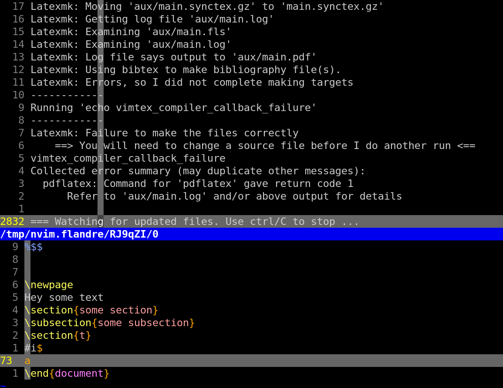
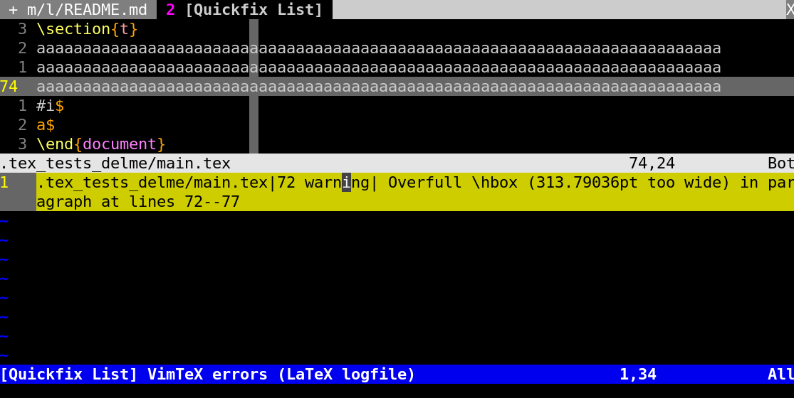

# Caveats and useful information
## Vimtex caveats
### pdflatex
#### Vimtex breaking on pdflatex logfiles and `-file-line-error`'s role in it
Vimtex relies on pdflatex to compile whatever you ask it to by default. While there are other compilers You could use I honestly don't see the point as pdflatex seems to not just be fast but also it has the best support.

There are times where it breaks in cryptic ways however if used trough Vimtex without the adequate (and seemingly **non standard**) parameters. The reason I write this abstract is to remind my future self AND others of the fact that setting `-file-line-error` to the `pdflatex` call conducted by Vimtex **IS CRUCIAL*.

Here is an example of the problematic behavior encountered:



> __I chose to include a picture here to better ilustrate the issue and to avoid confusion with the `:VimtexError`=`Quickfix List`-window you typically see at the bottom. Below you see the "end" of said windows content once again in plaintext (mostly so its machine readable)`__ 

```
!  ==> Fatal error occurred, no output PDF file produced!
Transcript written on aux/main.log.
Latexmk: Getting log file 'aux/main.log'
Latexmk: Examining 'aux/main.fls'
Latexmk: Examining 'aux/main.log'
Latexmk: Using bibtex to make bibliography file(s).
Latexmk: Errors, so I did not complete making targets
------------
Running 'echo vimtex_compiler_callback_failure'
------------
vimtex_compiler_callback_failure
Collected error summary (may duplicate other messages):
  pdflatex: Command for 'pdflatex' gave return code 1
      Refer to 'aux/main.log' and/or above output for details

=== Watching for updated files. Use ctrl/C to stop ...
Latexmk: Failure to make the files correctly
    ==> You will need to change a source file before I do another run <==
```

If you see this box for the first time you may believe that either:
-1) this is the way Vimtex displays errors to you
-2) this is a bug within pdflatex or simply Vimtex breaking

As for 1): the way Vimtex presents Errors/Warning to you is supposed to look more like this:



Which merely informs me that in the following location there is something worth emitting a warning over:
```
1   .tex_tests_delme/main.tex|72 warning| Overfull \hbox (313.79036pt too wide) in paragraph at lines 7
```

This unless you turned it of (you can still view it using :VimtexErrors) is the indended way for Vimtex to present warnings/errors to you. What you see in the previous picture is the result of Vimtex failing to properly parse the logfile pdflatex produced.

But why does it fail to do so and what role does `-file-line-error` play in it? To find that out we must scroll up further in the "unwanted" error window/buffer Vimtex opened (as in not the Quickfix-list one) and we see the error/s in question that lead to the compilation failing. I'll include an example for one of the errors that triggered this behavior:

```
! You can't use `macro parameter character #' in vertical mode.
l.70 #
      i$
! Missing $ inserted.
<inserted text>
                $
l.72 \end{document}
```


[2] (aux/main.aux) )
while there doesn't seem to be anything out of the ordinary in regards to this error message __sure its an error but Vimtex is supposed to properly present these to us (not literally "stop working" because of it)__.

There quite literally is "an error dealing with our error" quite ironically. The problem becomes obvious when you add `-file-line-error` to `pdflatex`'s commandline arguments.

```
./main.tex:70: You can't use `macro parameter character #' in vertical mode.
l.70 #
      i$
./main.tex:72: Missing $ inserted.
<inserted text>
                $
l.72 \end{document}


[2] (aux/main.aux) )
```

If you haven't already spotted it, the difference is that without setting this option the error may be split accross multiple lines like:

this:
```
l.70 #
      i$
! Missing $ inserted.
```
as opposed to:
```
./main.tex:72: Missing $ inserted.
```
which does it in one line.

Thus it seems as if Vimtex fails to parse errors not following the convention as given by `-file-line-error` like seen in the lower abstract. When using vimtex I've thus set `vimtex_compiler_latexmk` to sth like this:

```lua
vimtex_compiler_latexmk = {
    aux_dir = "aux",
    build_dir = "",
    emulate_aux = 1,
    options = { "-pdf", "-file-line-error", "-interaction=nonstopmode", "-sync "-pvc" },
},
```

Or if you use nixvim to configure ur nvim like me sth like this:
```nix
{
    compiler_latexmk = {
      aux_dir = "aux";
      build_dir = "";
      options = [
        "-pdf"
        "-file-line-error" # OUR LINE very important!
        "-interaction=nonstopmode"
        "-synctex=1"
        "-pvc"
      ];
    };
}
```

If you aren't sure if you've correctly applied the `options = []` you can always view them using `:VimtexInfo` __(make sure the .tex buffer is selected instead of the error-popup-whatever box)__
